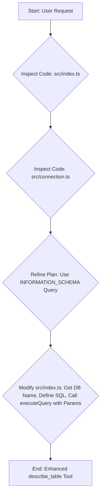

# Plan: Enhance `describe_table` Tool to Include Column Comments

**Goal:** Modify the `describe_table` tool in the `mariadb-mcp-server` project to include column comments in its response.

**Analysis:**

1.  The current implementation in `src/index.ts` uses the `DESCRIBE <table>` SQL command.
2.  The `executeQuery` function in `src/connection.ts` handles query execution and supports parameterized queries.
3.  To get comments, we need to query the `INFORMATION_SCHEMA.COLUMNS` table.

**Implementation Steps (in `src/index.ts`):**

1.  **Locate Handler:** Find the `case "describe_table":` block.
2.  **Import:** Add `getConfigFromEnv` to the imports from `./connection.js`.
3.  **Get Database Name:**
    *   Use `request.params.arguments?.database` if provided.
    *   Otherwise, call `getConfigFromEnv()` to get the default database name from the environment configuration. Handle the case where no database is provided and no default is set.
4.  **Define New SQL Query:**
    ```sql
    const sql = `
      SELECT
          COLUMN_NAME AS Field,
          COLUMN_TYPE AS Type,
          IS_NULLABLE AS \`Null\`,
          COLUMN_KEY AS \`Key\`,
          COLUMN_DEFAULT AS \`Default\`,
          EXTRA AS Extra,
          COLUMN_COMMENT AS Comment
      FROM
          INFORMATION_SCHEMA.COLUMNS
      WHERE
          TABLE_SCHEMA = ? AND TABLE_NAME = ?
      ORDER BY
          ORDINAL_POSITION;
    `;
    ```
5.  **Execute Modified Query:** Replace the existing `executeQuery` call with:
    ```typescript
    // Determine dbName as described in step 3
    const { rows } = await executeQuery(sql, [dbName, table], undefined);
    ```
    *(Pass `undefined` as the third argument to `executeQuery` since the database context is handled by the `WHERE TABLE_SCHEMA = ?` clause).*
6.  **Response:** The existing code that stringifies `rows` will automatically include the new `Comment` field.

**Diagram:**



**Next Step:** Switch to an implementation mode (e.g., "code") to apply these changes to `src/index.ts`.